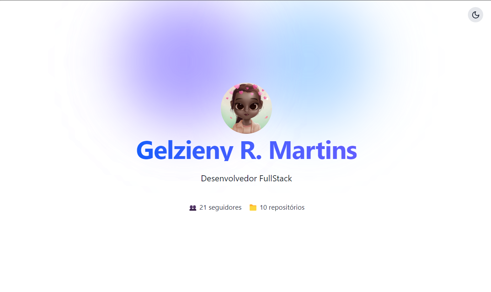
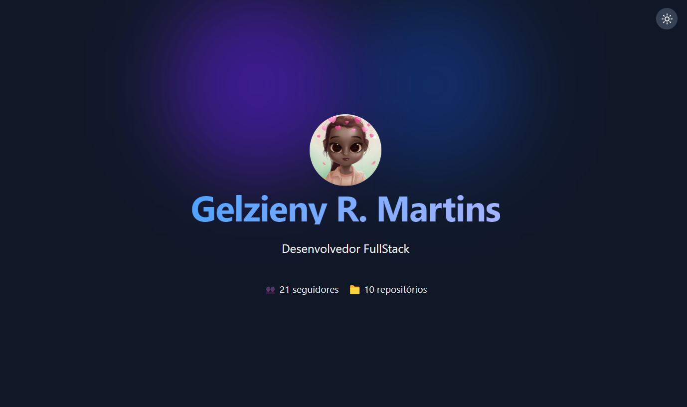

# 🌙 Black and White Tailwind CSS v4

Este projeto é um exemplo de como implementar **modo escuro** (dark mode) em uma aplicação React utilizando **Tailwind CSS v4**, **TypeScript**, e **Vite** para persistência do tema.

## 🛠️ Tecnologias Utilizadas

- [React](https://react.dev/)
- [TypeScript](https://www.typescriptlang.org/)
- [Vite](https://vitejs.dev/)
- [Tailwind CSS](https://tailwindcss.com/) v4
- [Lucide React](https://lucide.dev/) (para ícones)

## 📸 Preview do Projeto

  
  

# 🧑🏻‍💻 Autor

Feito com ❤️ por Gelzieny R. Martins 👋🏽 [Entre em contato!](https://www.linkedin.com/in/gelzieny-r-martins-180551106/)

## 📝 Licença

Este projeto esta sobe a licença [MIT](./LICENSE).